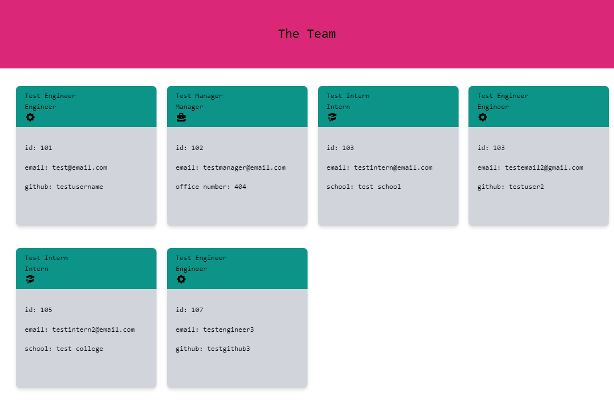
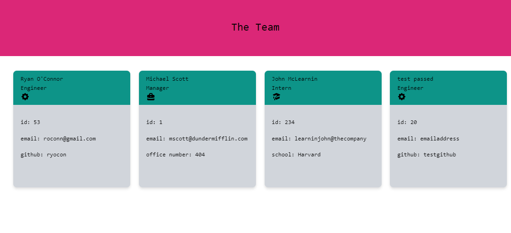

  # team-profile-gen

  

  ## Table of Contents
  - [Description](#description)
  - [Installation](#installation)
  - [Usage](#usage)
  - [Credits](#credits)
  - [Tests](#tests)
  - [Questions](#questions)
  - [License](#license)

  ## Description
  A Node.js based command line team profile generator that generates a HTML page based on user input from the inquirer package.

  ## Installation
  The project wiil need to be cloned from Github and Node.js will needed to be installed to run the application. Once cloned the user should run the following commands using Node -

To install dependencies (jest, inquirer) - <br>
  ```npm i```

To run the application - <br>
```node index.js```

  ## Usage
  Once index.js is ran using the command line using node the user will need to answer the prompts, once completed select 'No more at this time' and the HTML page will generate into the /dist folder.

  ## License

  This project uses the MIT license.

  ## Tests
  To run tests the user should input the following into Node -
  
  ```npm test```

  ## Questions
  For any questions please contact via Github or email.

  Github - https://github.com/Ryocon

  Email - roconn@gmail.com

  ## Demo


https://user-images.githubusercontent.com/54818132/157533779-1b551e9c-0315-4659-88ee-a6b32b885f96.mp4


  ## Screenshots

  

  <br>

  Example output from the demo video -

  


